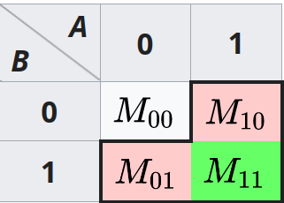

# Jaccard index

Also known as the Jaccard similarity coefficient.

## Calculation

For two sample sets $A$ and $B$, the jaccard index is defined as the
size of the union divided by the size of the intersection.

$$J(A, B) = \frac{|A \cup B |}{|A \cap B|}$$

Note that $0 \le J \ge 1$ where $J=0$ if the intersection is empty, and
$J=1$ if the intersection equals the union.

The Jaccard distances can be simply defines as

$$ d_{j}(A, B) = 1 - J(A, b) $$

When computing for binary attributes, namely items beings either in $A$,
$B$, $A \cap B $. The Jaccard similarity is given as

$$ J = \frac{M_{11}}{M_{01} + M_{10} + M_{11}} $$

where $M_{11}$ is the number of items that are in both $A$ and $B$, $M_{01}$
is the number of items that are in $A$ but not in $B$, and $M_{10}$ is the
number of items that are in $B$ but not in $A$.

## Relations to simple matching coefficient

When used on binary attributes, the Jaccard index is closely related to 
[simple matching coefficient](../104), as it simply does
not includes items that are note in $A$ or $B$ (i.e., $M_{00}$) in the
denominator.

## References

Wikipedia contributors. (2024, January 16). Jaccard index. In Wikipedia, The Free Encyclopedia. Retrieved 07:28, April 3, 2024, from <https://en.wikipedia.org/w/index.php?title=Jaccard_index&oldid=1196092673>
