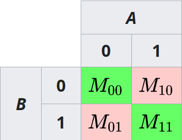

# Simple matching coefficient

The simple matching coefficient (SMC) is a measure of similarity between two sets of data. It is defined as the proportion of agreements between two sets of data. The SMC is calculated as the sum of the number of agreements between two sets of data divided by the total number of data points.

$$ SMC = \frac{M_{11} + M_{00}}{M_{00} + M_{01} + M_{10} + M_{11}} $$

where 
    - $M_{11}$ is the number of agreements between two sets of data
    - $M_{00}$ is the number of disagreements between two sets of data
    - $M_{01}$ is the number of data points that are in the first set but not in the second set,
    - $M_{10}$ is the number of data points that are in the second set but not in the first set.

The SMC ranges from 0 to 1, where 0 indicates no similarity between two sets of data and 1 indicates perfect similarity between two sets of data.

## References

Wikipedia contributors. (2023, July 6). Simple matching coefficient. In Wikipedia, The Free Encyclopedia. Retrieved 08:00, April 3, 2024, from <https://en.wikipedia.org/w/index.php?title=Simple_matching_coefficient&oldid=1163706482>

