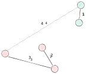

# Complete-linkage clustering

#clustering #method

Opposite to the [single-linkage](../29) algorithm, the fusion depends on the most distant pairs of objects.
Also called **furthest neighbour sorting** or **Farthest Point Algorithm**.

**Calculation**
Fuse two clusters if the maximum distance between pairwise points
is $\leq$ that the distance level of the current partition.

$$d(u, v) = max(dist(u_{i}, v_{j}))$$

On step 1 and 2, objects are fused into green and red cluster respectively.
On step 3, the leftmost object is fused with the red cluster using the pairwise distance with the furthest object.
Step 4 fuse both the red and green cluster based on maxixum pairwise distance.

**PROS**
- Tends to produces clusters with clear discontinuities

**CONS**
- As cluster grows, it become more difficult to add new objects to the cluster.

**Shape**
- In comparison, complete linkage tends to produce spherical clusters, while single linkage tends to producs elongated clusters.

From Legendre (2012):

> According to Lance & Williams (1967c), this is equivalent to dilating the reference space in the neighbourhood of that cluster \[...\]
> This effect is opposite to what was found in single linkage clustering, which contracted the reference space.
> In \[descriptor space\], complete linkage produces maximally linked and rather spherical clusters,
> whereas single linkage may produce elongated clusters with loose chaining (p.351)[^ref1].

[^ref1]: Legendre, P., & Legendre, L. (2012). Numerical ecology (3rd ed., Vol. 24). Elsevier.

