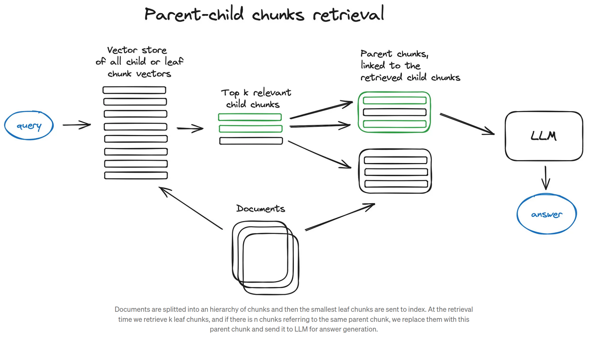

# Auto-merging Retrieval (aka parent document retriever)

## What is it

The idea here is pretty much similar to [sentence-window retrieval](../64) — 
to search for more granular pieces of information and then to extend the context window that is sent to the LLM

Instead of taking the "surrounding sentences", it organize chunk as a tree, with connection based on their relevance connection.

## How it work
- Define a hierarchy of smaller chunks linked to parent chunks
- If the set of parent chunk exceeds some threshold, then merge smaller chunks intor the bigger parent chunk
- Auto-merging is complementary to [sentence-window retrieval](../64)

[^1]

## Implementation
- LlamaIndex

## Parameters
- Hierarchical structure (Number of levels / children)
- Number of chunks

[^1]: From [towardsai](https://pub.towardsai.net/advanced-rag-techniques-an-illustrated-overview-04d193d8fec6)
