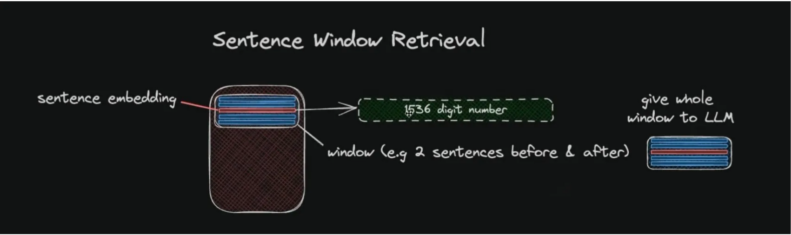

# Sentence Window Retrieval

## What is it
Fetch a context from a document database based on the query, but then use a "larger context", namely the surrouding information or the window when feeding the LLM.

**Graphical exemple**

## Application

- Each sentence is index
- Take k sentence around (the window)
- Send this extended context to the LLM with the question

## Parameters
- Number of surrounding sentences (Window size)

